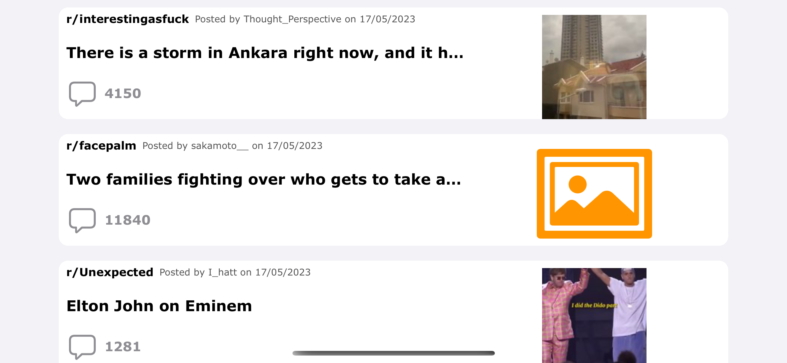

#  RedditTheGrint

## Tooling

- Xcode 14.2
- Cocoapods

## Dependencies

- Alamofire
- SDWebImage

## Building

Install Cocoapods dependencies before building the project.
```
sudo gem install cocoapods
pod install
```

## Screenshots

| Portrait      | Landscape   | Detail     |
|   :----:  |    :----:    |   :----:   |
|  |  |  |

## License

RedditTheGrint is released under the MIT license. See LICENSE for details.
